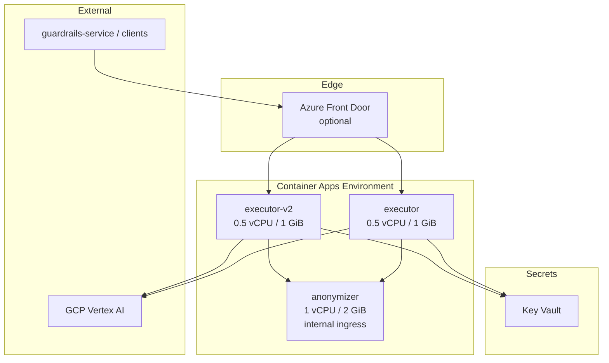

# Azure deployment plan — Agent Guard

See also [README.md](../README.md) and [ENV.md](../ENV.md).

Target: match Cloudflare production scale and latency at lower cost (~$400/mo → ~$80–150/mo infra).

## Current Cloudflare baseline

| Component | CF config | Role |
|-----------|-----------|------|
| executor / executor-v2 | Python Workers × 2 | LLM cascade + local scanners |
| anonymizer-worker | Container `standard-4` (4 vCPU, 12 GiB), max 5 | Presidio PII |
| Traffic pattern | Bursty, scale-to-zero containers | `sleepAfter` 5m (anonymizer), 2h (legacy) |

**Latency profile:** cascade dominated by GCP Vertex (Qwen + Gemma); local scanners &lt;100ms; anonymizer cold start 2–5s on CF container wake.

**Images (CI):**

- `aktosecurity/akto-agent-guard-executor:<tag>` — legacy ONNX container (existing consumers)
- `aktosecurity/akto-agent-guard-worker:<tag>` — portable FastAPI executor
- `aktosecurity/akto-agent-guard-anonymizer:<tag>` — Presidio anonymizer

---

## Recommended Azure architecture



### Why Container Apps (Consumption)

- Scale-to-zero on executor (matches CF Workers idle cost)
- HTTP scaling rules (matches request-driven CF model)
- Internal ingress for anonymizer (replaces CF service binding)
- No cluster management vs AKS
- Per-second billing with free grant (180K vCPU-s, 360K GiB-s/mo)

AKS is viable if you already run a cluster; otherwise Container Apps is simpler and cheaper at this scale.

---

## Sizing — match Cloudflare capacity

Cloudflare anonymizer: up to 5 × `standard-4` (4 vCPU, 12 GiB). Executor Workers are lightweight; CPU is mostly Vertex I/O wait.

| App | CPU | Memory | minReplicas | maxReplicas | Rationale |
|-----|-----|--------|-------------|-------------|-----------|
| executor | 0.5 | 1 GiB | 1 | 20 | Warm instance avoids cold start; burst to 20 matches CF Worker concurrency |
| executor-v2 | 0.5 | 1 GiB | 1 | 20 | Same image, different `DEFAULT_MODEL_CONFIG_JSON` secret |
| anonymizer | 1.0 | 2 GiB | 1 | 5 | Matches CF max 5 instances; 2 GiB enough for spaCy (CF over-provisions at 12 GiB) |

**Cost optimization:** start with `minReplicas: 1` on executor (not 0) if p95 latency must match CF Workers (~no cold start). Use `minReplicas: 0` on executor only after measuring acceptable cold-start budget.

**Region:** deploy in the same geography as GCP Vertex endpoints (e.g. `us-central1` Vertex → `centralus` Azure) to preserve cascade latency.

---

## Step-by-step deployment

### Phase 0 — Prerequisites (day 1)

1. Azure subscription + resource group (e.g. `rg-agent-guard-prod`)
2. Log Analytics workspace + Container Apps Environment
3. Key Vault for Vertex SA keys, Slack, `DEFAULT_MODEL_CONFIG_JSON`
4. **Container registry** — see [Image registry](#image-registry) below (ACR is optional)

### Image registry

**You do not need ACR** if images already live on Docker Hub or ECR.

| Registry | Works with Container Apps? | Notes |
|----------|--------------------------|-------|
| **Docker Hub** (`aktosecurity/...`) | Yes | Configure registry credentials on the Container App Environment |
| **AWS ECR Public** (`public.ecr.aws/aktosecurity/p7q3h0z2/...`) | Yes | Same — add ECR credentials to the environment |
| **Azure ACR** | Yes | Only needed if you want all images inside Azure (faster pulls, no cross-cloud auth) |

Point Container Apps directly at CI tags, e.g.:

```text
docker.io/aktosecurity/akto-agent-guard-worker:a-master
public.ecr.aws/aktosecurity/p7q3h0z2/akto-agent-guard-worker:1.2.3
```

`az acr import` is a convenience for mirroring into ACR — not required.

```bash
# Container Apps Environment — one-time registry setup (Docker Hub example)
az containerapp env registry set \
  --name <cae-name> \
  --resource-group rg-agent-guard-prod \
  --server docker.io \
  --username <dockerhub-user> \
  --password <dockerhub-token>
```

### Phase 1 — Images (day 1)

Images are produced by CI (`staging.yml` / `prod.yml`). Use the tag from the workflow summary (e.g. `a-master` or release version).

```bash
# Verify images exist (no ACR copy needed)
docker pull aktosecurity/akto-agent-guard-worker:1.2.3
docker pull aktosecurity/akto-agent-guard-anonymizer:1.2.3
```

Optional — mirror into ACR only if you prefer Azure-native pulls:

```bash
az acr import --name <acr> \
  --source docker.io/aktosecurity/akto-agent-guard-worker:1.2.3 \
  --image akto-agent-guard-worker:1.2.3
```

### Phase 2 — Anonymizer Container App (day 1–2)

```bash
az containerapp create \
  --name agent-guard-anonymizer \
  --resource-group rg-agent-guard-prod \
  --environment <cae-name> \
  --image docker.io/aktosecurity/akto-agent-guard-anonymizer:1.2.3 \
  --ingress internal \
  --target-port 8093 \
  --cpu 1.0 --memory 2Gi \
  --min-replicas 1 --max-replicas 5 \
  --scale-rule-name http --scale-rule-type http \
  --scale-rule-http-concurrency 50
```

Note internal FQDN: `agent-guard-anonymizer.internal.<env>.azurecontainerapps.io`

### Phase 3 — Executor Container Apps × 2 (day 2)

Deploy **same image twice** with different secrets (mirrors CF executor vs executor-v2):

| Secret | executor | executor-v2 |
|--------|----------|-------------|
| `DEFAULT_MODEL_CONFIG_JSON` | prod modelMap | v2 modelMap |
| `ANONYMIZER_URL` | `https://agent-guard-anonymizer.internal...` | same |

```bash
az containerapp create \
  --name agent-guard-executor \
  --resource-group rg-agent-guard-prod \
  --environment <cae-name> \
  --image docker.io/aktosecurity/akto-agent-guard-worker:1.2.3 \
  --ingress external \
  --target-port 8090 \
  --cpu 0.5 --memory 1Gi \
  --min-replicas 1 --max-replicas 20 \
  --env-vars ANONYMIZER_URL=https://agent-guard-anonymizer.internal.<env>.azurecontainerapps.io \
  --secrets qwen-key=<kv-ref> gemma-key=<kv-ref> ... \
  --scale-rule-name http --scale-rule-type http \
  --scale-rule-http-concurrency 100
```

Repeat for `agent-guard-executor-v2` with v2 secrets.

### Phase 4 — DNS & cutover (day 3–5)

1. **Shadow traffic:** duplicate 10% of scans to Azure URL; compare `is_valid` / `risk_score` / latency
2. **Front Door (optional):** weighted routing CF 90% / Azure 10% → 0% CF
3. Update callers:
   - `guardrails-service` `AGENT_GUARD_ENGINE_URL`
   - Any hardcoded `*.workers.dev` URLs
4. Run `smoke.sh` against Azure FQDN
5. Monitor 1 week; decommission CF workers

### Phase 5 — Observability

- Container Apps → Log Analytics (requests, restarts, scale events)
- Alerts: 5xx rate, p95 latency, replica count, Vertex error rate in `details.error`
- Azure Cost Management budget alert at $120/mo

---

## Latency parity checklist

| Metric | CF baseline | Azure target | How to measure |
|--------|-------------|--------------|----------------|
| Local scanner p95 | capture from CF analytics | ≤ CF + 10ms | k6 on BanSubstrings/Secrets |
| Cascade p95 | CF + Vertex | ≈ same (region-aligned Vertex) | k6 on PromptInjection |
| Anonymize p95 | CF container warm | ≤ CF + 20ms | dedicated Anonymize load test |
| Cold start | Worker ~0ms; container 2–5s | executor minReplicas=1 → ~0ms | burst after 30 min idle |
| Error rate | CF baseline | ≤ baseline | compare 5xx + fail-open rate |

**k6 smoke script:** reuse `worker-py/scripts/smoke.sh` endpoints in a loop at production RPS.

---

## Cost estimate (monthly)

Assumptions: ~500K requests/mo, executor minReplicas=1, anonymizer minReplicas=1, moderate burst.

| Item | Estimate |
|------|----------|
| 2× executor (0.5 vCPU, 1 GiB, always warm) | ~$25 |
| 1× anonymizer (1 vCPU, 2 GiB, always warm) | ~$25 |
| Burst scale-out overages | ~$15–40 |
| ACR Basic (optional) | ~$0–5 |
| Log Analytics | ~$10–25 |
| Key Vault | ~$1 |
| Front Door (optional) | ~$35 base |
| **Total infra** | **~$80–120** (no Front Door) / **~$115–155** (with Front Door) |

Vertex AI inference cost is unchanged (external to Azure).

Compare to ~$400/mo Cloudflare (containers + Workers overages).

---

## Auto-updates

Goal: new CI image tag → Container Apps pick it up without manual `az containerapp update` every time.

### Recommended: CI deploy step after image push

Add a job (or workflow) that runs after `staging` / `prod` agent-guard builds succeed:

```bash
az containerapp update \
  --name agent-guard-worker \
  --resource-group rg-agent-guard-prod \
  --image docker.io/aktosecurity/akto-agent-guard-worker:${IMAGE_TAG}

az containerapp update \
  --name agent-guard-anonymizer \
  --resource-group rg-agent-guard-prod \
  --image docker.io/aktosecurity/akto-agent-guard-anonymizer:${IMAGE_TAG}
```

Use GitHub Actions with `azure/login` + the same `IMAGE_TAG` from the build job. Container Apps creates a **new revision** and shifts traffic when the update completes (zero-downtime if health probes pass).

**Staging vs prod:** deploy `a-<branch>` tags to a staging Container Apps env; deploy release tags (`1.2.3`) to prod only from `prod.yml` or manual approval.

### Alternative patterns

| Approach | Auto-update? | Trade-off |
|----------|--------------|-----------|
| **CI `az containerapp update`** (above) | Yes, on every successful build | Best control; tag is explicit |
| **`:latest` tag + periodic pull** | Partial | Container Apps does not auto-pull `:latest`; you must still trigger update |
| **Watchtower / cron on VM** | Yes for VM compose only | Not for Container Apps |
| **Flux / Argo CD (AKS)** | Yes | Overkill unless you already use GitOps |

### Safe rollout

1. Deploy new revision with **traffic weight 0%** (preview revision)
2. Run `smoke.sh` against revision FQDN
3. Shift 100% traffic: `az containerapp ingress traffic set --revision-weight <new>=100`

Or use **single revision mode** (default) — each `update` replaces active revision after health checks pass.

---

## Rollback

Keep Cloudflare workers deployable (`pywrangler deploy`). Rollback = flip DNS / env URL to `*.workers.dev` in minutes. No code change required.

---

## Alternative: AKS

Use if you already operate AKS. Apply `deploy/kubernetes/` manifests (future), attach ACR, install AGIC/nginx ingress. Higher baseline cost (~$150+/mo for node pool) but more control. Not recommended solely for Agent Guard unless part of existing platform.

## Alternative: VM + docker compose

Lowest ops complexity for a single region:

```bash
AGENT_GUARD_WORKER_TAG=1.2.3 AGENT_GUARD_ANONYMIZER_TAG=1.2.3 docker compose pull
docker compose up -d
```

Suitable for staging; production needs manual HA (2 VMs + load balancer) to match CF scale.
