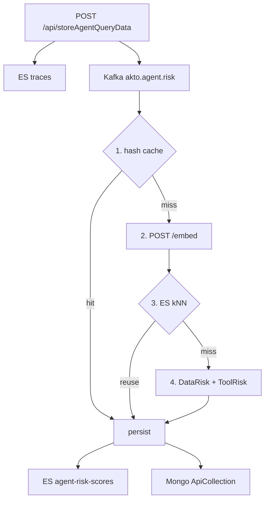

# Agent risk scoring

Cyborg scores traces **after** ingest. Mini-runtime does not score. Flags default off. Kafka produce failure must not fail `POST /api/storeAgentQueryData`.



## Kafka

Ingest always writes traces first (traffic Kafka if `KAFKA_WRITE_ENABLED`, else ES bulk). If `AGENT_RISK_SCORE_ENABLED`, `AgentRiskKafkaProducer` then sends a **separate** job to `akto.agent.risk`, partition key `accountId`:

```json
{ "triggerMethod": "scoreAgentQueryRecords", "payload": "[...traces]", "accountId": 123 }
```

`AgentRiskKafkaConsumer` (group `agent-risk-consumer`) starts only when `AGENT_RISK_KAFKA_CONSUMER_ENABLED`. It scores the batch, persists, then `commitSync`. The **trace** Kafka consumer must ES-write only — it must not re-enter the HTTP action, or risk jobs are produced twice.

## Scoring

`AgentRiskScorer` never throws. Fail-open at every step (embed/kNN error → rules).

1. **Hash cache** — SHA-256 of `accountId + agentKey + redacted prompt`. Reuse only if `canReuse` (same agent/privilege, no stale category). Else try kNN, else rules.
2. **Embed** — `POST {AGENT_EMBED_SERVICE_URL}/embed` `{text}` → `{vector}`. Skipped if URL unset or prompt &gt; 1000 chars. No Java embedder.
3. **kNN** — ES `dense_vector` on `agent-risk-scores` (`k=1`), filtered by account + agent. Distance = `1 - _score`. Reuse if distance ≤ 0.15, neighbor composite &lt; 70, and tools/privilege match. High-risk neighbors are never reused.
4. **Rules** — `DataRisk` and `ToolRisk` in parallel. Composite = **max** (email 40, PAN/SSN 80, JWT/PEM 90; shell 85, filesystem 70, db.write 65, browser 40).

Redaction on the prompt is for hash/embed only. DataRisk scans raw query + response.

## Persist

Once per Kafka poll, not per record:

- **ES `agent-risk-scores`** — per-trace score + vector (this is what kNN searches next time)
- **ES traces** — `topicProcessed=true` (score does not live on the trace)
- **Mongo `ApiCollection.agentRiskScore`** — batch-max rollup on the collection. Write if missing, higher, or older than 24h. `upsert: false`.
